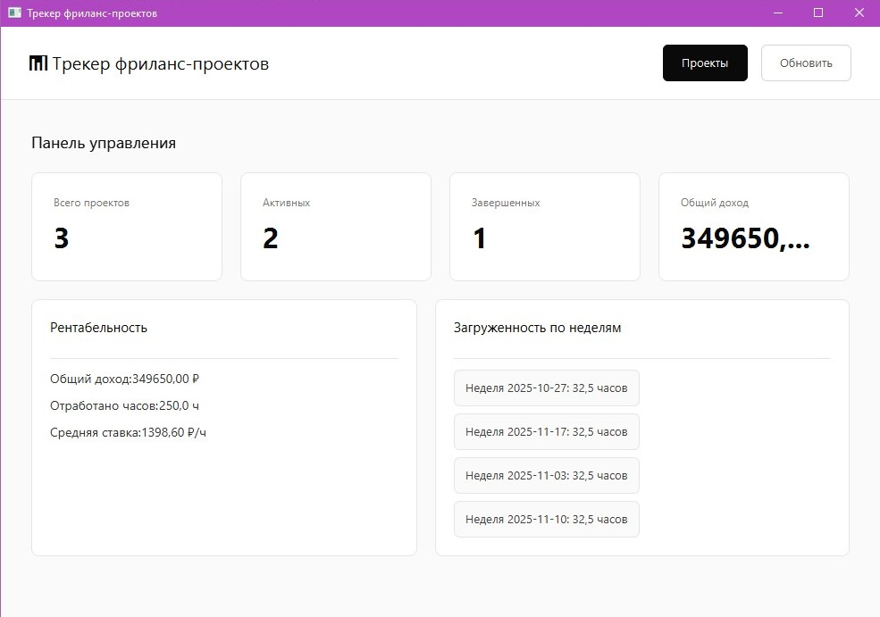
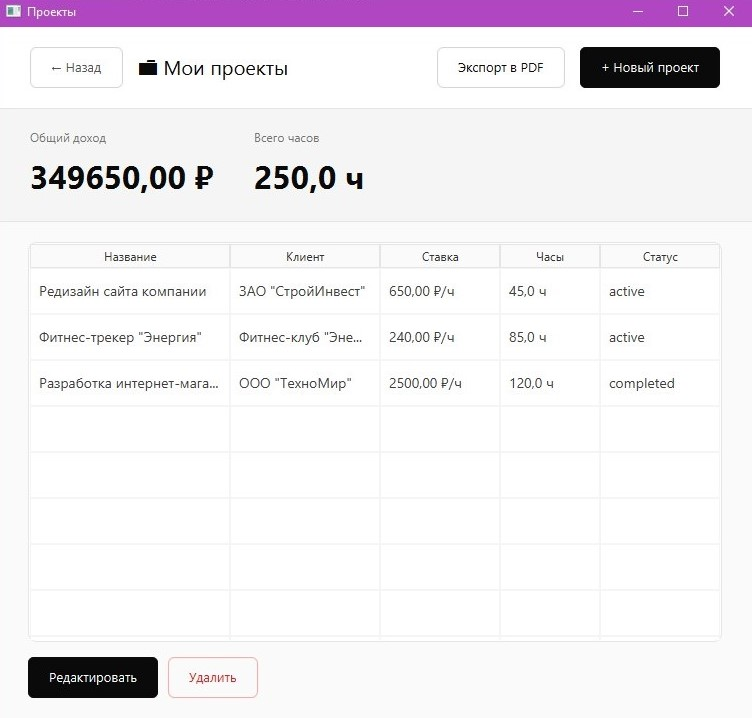
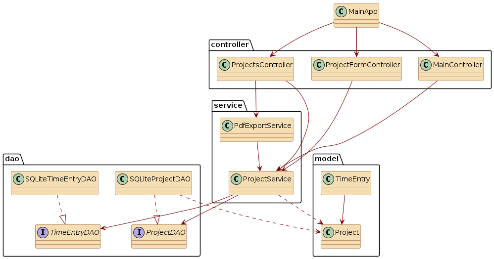

# Трекер фриланс-проектов

----

**Описание**: Приложение для управления портфелем фриланс-проектов с автоматическим расчетом рентабельности и анализом загруженности. Приложение решает проблему отслеживания доходности проектов, выявления переработок и быстрой генерации отчетов для клиентов. Это программное обеспечение помогает фрилансерам эффективно управлять временем, избегать выгорания и максимизировать прибыль.

- **Технологический стек**: Java 11+, JavaFX 17.0.2, SQLite 3.43, iText 7.2.5, Maven. Standalone desktop application.
- **Статус**: v1.0.0 - Stable Release. Все основные функции реализованы и протестированы.
- **Ссылка на продукт**: Локальное десктопное приложение, запускается через JAR файл или Maven.
- **Отличие от аналогов**: Фокус на фрилансерах, автоматический расчет рентабельности, встроенный анализ переработок, генерация PDF-отчетов без внешних сервисов, работает полностью оффлайн.
----
## Скриншоты рабочих окон приложения:
### Главное окно (Панель управления)
Панель управления отображает общую статистику по всем проектам, показатели рентабельности и анализ загруженности по неделям.


### Список проектов
Таблица со всеми проектами, статистикой и возможностью управления: создание, редактирование, удаление и экспорт в PDF.

----
## Архитектура


### Назначение пакетов:
- controller/ - контроллеры JavaFX для управления UI компонентами (MVC паттерн)
- model/ - модели данных (POJO классы Project, TimeEntry)
- dao/ - интерфейсы и реализации Data Access Objects для работы с базой данных
- service/ - бизнес-логика приложения (расчеты рентабельности, экспорт в PDF)
----
## Зависимости
Для работы программного обеспечения необходимы следующие компоненты:

**Обязательные зависимости:**
**Java Development Kit (JDK)** версии 11 или выше
- **Apache Maven** версии 3.6 или выше для сборки проекта
- **JavaFX SDK** версии 17.0.2 (подключается автоматически через Maven)

**Библиотеки (управляются Maven):**
- **JavaFX Controls & FXML** (17.0.2) - GUI фреймворк
- **SQLite JDBC Driver** (3.43.0.0) - работа с базой данных SQLite
- **iText 7 Core** (7.2.5) - генерация PDF документов
- **Jackson Databind** (2.14.2) - обработка JSON данных

**Системные требования:**
- Операционная система: Windows 10/11, macOS 10.14+, Linux (Ubuntu 18.04+)
- ОЗУ: минимум 512 МБ, рекомендуется 1 ГБ
- Свободное место на диске: 100 МБ
----
## Установка
**Шаг 1: Проверка требований**
Убедитесь, что установлены Java 11+ и Maven:
```bash
java -version
# Ожидается: java version "11" или выше
mvn -version
# Ожидается: Apache Maven 3.6.x или выше
```
**Шаг 2: Клонирование репозитория**

git clone https://github.com/AnnaRzhavikina/FreelanceTracker.git
```bash
cd freelance-tracker
```
**Шаг 3: Установка зависимостей**
```bash
mvn clean install
```
**Шаг 4: Запуск приложения**

Через Maven:
```bash
mvn javafx:run
```
**Шаг 5: Первый запуск**

При первом запуске автоматически создается:
- Папка data/ в корне проекта
- База данных SQLite freelance.db с таблицами projects и time_entries
----
## Применение
### Основные функции

**1. Управление проектами**

- **Создание проекта**: Перейдите в "Проекты" → "Новый проект" → Заполните форму (название, клиент, ставка обязательны) → "Сохранить"
- **Редактирование**: Выберите проект в таблице → "Редактировать" → Измените поля → "Сохранить"
- **Удаление**: Выберите проект → "Удалить" → Подтвердите в диалоге

**Поля проекта:**
- Название проекта (обязательно)
- Имя клиента (обязательно)
- Почасовая ставка в ₽/час (обязательно, должна быть > 0)
- Отработанные часы (по умолчанию 0, не может быть отрицательным)
- Статус: `active` (активен), `paused` (приостановлен), `completed` (завершен)
- Дата начала (автоматически устанавливается текущая дата)
- Дата окончания (опционально)
- Описание проекта (опционально)

**2. Расчет рентабельности**

Система автоматически рассчитывает:
- **Доход по проекту** = Ставка × Часы
- **Общий доход** = Сумма доходов всех проектов
- **Средняя ставка** = Общий доход / Общие часы
- **Статистика по статусам** = Количество активных/завершенных проектов

**3. Планирование нагрузки**

На главной панели отображается:
- **Загруженность по неделям** - распределение часов по 4 неделям
- **Предупреждения о переработках** - автоматическое выявление недель с более чем 40 часами работы

**4. Экспорт отчета в PDF**

1. Перейдите в раздел "Проекты"
2. Нажмите "Экспорт в PDF"
3. Выберите место сохранения и имя файла
4. Нажмите "Сохранить"

**Содержимое PDF:**
- Заголовок "ОТЧЕТ ПО ФРИЛАНС-ПРОЕКТАМ"
- Дата формирования отчета
- Общая рентабельность (доход, часы, средняя ставка, количество проектов)
- Таблица всех проектов (название, клиент, ставка, часы, доход, статус)
- Предупреждения о переработках (если есть недели с >40 часами)
----
## Проверка ПО
Приложение включает функциональное тестирование основных компонентов.

**Ручное тестирование:**
Протестируйте следующие сценарии:
1. **Создание проекта с валидными данными**
   - Ожидается: проект успешно создан и отображается в таблице
2. **Валидация данных**
   - Попробуйте создать проект без названия
   - Ожидается: сообщение об ошибке "Название проекта обязательно"
3. **Расчет дохода**
   - Создайте проект: ставка 1500₽/ч, часы 40
   - Ожидается: доход = 60000₽
4. **Удаление проекта**
   - Выберите проект, нажмите "Удалить", подтвердите
   - Ожидается: проект удален из таблицы, статистика обновлена
5. **Экспорт в PDF**
   - Нажмите "Экспорт в PDF", сохраните файл
   - Ожидается: PDF файл создан, содержит таблицу и статистику
     Полные тестовые сценарии описаны в документации (раздел 3.2 "Тестирование ПС").
----
## Проблемы
**Известные ограничения:**
1. **Детальный учет времени не реализован в UI** - Модель `TimeEntry` присутствует в архитектуре для будущего расширения, но в текущей версии (v1.0.0) фиксация часов осуществляется на уровне проекта через поле `hoursWorked`.
2. **Нет поиска по проектам** - В текущей версии отсутствует функция поиска и фильтрации проектов в таблице.
3. **Загруженность по неделям рассчитывается приблизительно** - Система равномерно распределяет часы по 4 неделям от даты начала проекта.
4. **Нет резервного копирования** - База данных SQLite не имеет автоматического резервного копирования. Рекомендуется вручную копировать файл `data/freelance.db`.
----
## Получение справочной информации
**Как получить помощь:**
1. **Документация** - Полное описание функциональности в файлах проекта
2. **Email** - Напишите на rav2025@mail.ru
----
## Приглашение к сотрудничеству
Мы приветствуем ваш вклад в развитие проекта!
**Планируемые улучшения:**
1. **Детальный учет времени** - Реализация функционала TimeEntry для трекинга времени по отдельным задачам внутри проекта
2. **Поиск и фильтрация** - Добавление поиска проектов по названию, клиенту, статусу
3. **Графики и диаграммы** - Визуализация доходности с помощью JavaFX Charts
4. **Импорт/экспорт данных** - Поддержка CSV, Excel форматов
5. **Календарь дедлайнов** - Планирование и отслеживание сроков выполнения проектов
6. **Темная тема** - Добавление темной цветовой схемы интерфейса
----
## Open source licensing info
- Проект распространяется под лицензией MIT License - свободное использование, изменение и распространение
----
## Источники и справочники
**Технические справочники:**
1. [JavaFX CSS Reference](https://openjfx.io/javadoc/17/javafx.graphics/javafx/scene/doc-files/cssref.html)
2. [JDBC Tutorial](https://docs.oracle.com/javase/tutorial/jdbc/)
3. [Maven Documentation](https://maven.apache.org/guides/)